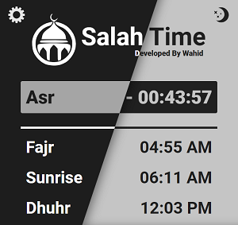

<h1 align="center">
 Salah Time
</h1>

Salah Time is a browser extension which shows the daily Muslim Prayer local time based on the location. It's a highly configurable extension allowing User to set/change location automatically or manually. And it also allows the user to fine-tune/offset prayer times and set prayer time calculation method. Salah Time does not collect any user data.

Website: [www.salah-time.com](https://salah-time.com/)

## Features
- Plays Adhan at the prayer time
- Offline Usability (After fetching the prayer times for first time online)
- Set Location Automatically or Manually (*Need Internet Connection!*)

  

- Light and Dark mode to suit user preferences
  
  

- Change Extension Scale / Zoom.
  
  

- Tune / Offset prayer time in minutes

    
***

### API 
[AlAdhan - Prayer Times API (1.00)](https://aladhan.com/prayer-times-api)

A RESTful API to get islamic prayer times for a given day, month or year.

The API has several endpoints to assist developers. All the endpoints return JSON and are available over http and https.

Please note that prayer timings might not always match your local mosque or government authority. Their timings are likely tuned or adjusted.

***

### Prayer Time Calculation Method

The default calculation method is: ***Umm Al-Qura University, Makkah***

Default calculation method can be changed in the setting.

All the calculation methods are as follows:
1. Jafari / Shia Ithna-Ashari
2. University of Islamic Sciences, Karachi
3. Islamic Society of North America
4. Muslim World League
5. Umm Al-Qura University, Makkah
6. Egyptian General Authority of Survey
7. Institute of Geophysics, University of Tehran
8. Gulf Region
9. Kuwait
10. Qatar
11. Majlis Ugama Islam Singapura, Singapore
12. Union Organization islamic de France
13. Diyanet İşleri Başkanlığı, Turkey
14. Spiritual Administration of Muslims of Russia
15. Moonsighting Committee Worldwide (also requires shafaq parameter)
16. Dubai (experimental)
17. Jabatan Kemajuan Islam Malaysia (JAKIM)
18. Tunisia
19. Algeria
20. KEMENAG - Kementerian Agama Republik Indonesia
21. Morocco
22. Comunidade Islamica de Lisboa
23. Ministry of Awqaf, Islamic Affairs and Holy Places, Jordan
***

 Developed By <a href="https://github.com/w4-h1d">Wahid</a>

&copy; 2024 Najmul Huda Wahid. All Rights Reserved.

***